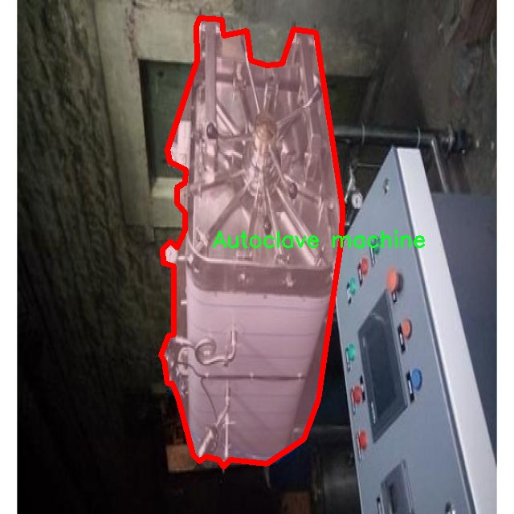

# 医院设备图像分割系统： yolov8-seg-rtdetr

### 1.研究背景与意义

[参考博客](https://gitee.com/YOLOv8_YOLOv11_Segmentation_Studio/projects)

[博客来源](https://kdocs.cn/l/cszuIiCKVNis)

研究背景与意义

随着医疗技术的迅猛发展，医院设备的种类和数量不断增加，如何高效、准确地管理和维护这些设备成为了医院运营中的一项重要任务。医院设备的图像识别与分割技术在这一背景下应运而生，能够为设备的自动识别、监控及维护提供有力支持。传统的设备管理方式往往依赖人工巡检，效率低下且容易出错，尤其是在大型医院中，设备种类繁多、分布广泛，人工管理的复杂性和工作强度显著增加。因此，基于计算机视觉的自动化设备管理系统逐渐成为研究的热点。

在众多计算机视觉技术中，YOLO（You Only Look Once）系列模型因其高效的实时目标检测能力而备受关注。YOLOv8作为该系列的最新版本，进一步提升了检测精度和速度，适用于复杂的医疗环境。然而，现有的YOLOv8模型在医院设备图像分割任务中仍存在一定的局限性，尤其是在处理细小设备、复杂背景和多类别设备时，分割效果不尽如人意。因此，针对医院设备图像分割任务，对YOLOv8进行改进，提升其在实例分割中的表现，具有重要的研究意义。

本研究基于一个包含2500张图像和32个类别的医院设备数据集，涵盖了从麻醉机到C臂机等多种设备，旨在构建一个高效的医院设备图像分割系统。该数据集的多样性和丰富性为模型的训练和验证提供了良好的基础，使得模型能够在不同设备和环境下进行有效的学习和适应。通过对YOLOv8模型的改进，结合深度学习中的先进技术，如注意力机制和特征融合，期望能够显著提升模型在医院设备图像分割任务中的性能。

本研究的意义不仅在于技术上的创新，更在于其对医院管理实践的深远影响。通过实现高效的设备图像分割，医院能够实时监控设备状态，及时发现设备故障，降低维护成本，提高设备利用率。此外，自动化的设备管理系统还能够减轻医务人员的工作负担，使其能够将更多精力投入到患者护理和医疗服务中，提升整体医疗服务质量。

综上所述，基于改进YOLOv8的医院设备图像分割系统的研究，不仅具有重要的学术价值，还有助于推动医院设备管理的智能化进程，为未来的医疗行业发展提供新的思路和解决方案。通过深入探索这一领域，我们期望能够为医院设备的高效管理和维护提供切实可行的技术支持，进而提升医疗服务的整体水平。

### 2.图片演示


注意：本项目提供完整的训练源码数据集和训练教程,由于此博客编辑较早,暂不提供权重文件（best.pt）,需要按照6.训练教程进行训练后实现上图效果。

### 3.视频演示

[3.1 视频演示](https://www.bilibili.com/video/BV1JHzFYTEas/)

### 4.数据集信息

##### 4.1 数据集类别数＆类别名

nc: 31
names: ['Anesthesia machine bottom', 'Anesthesia machine top', 'Autoclave machine', 'Bed side table', 'Bin', 'C-Arm Machine', 'C-Arm Machine bottom', 'C-Arm Machine top', 'C-Arm Monitor', 'Chair', 'Manman drilling', 'Medicine trolley', 'Monitor', 'Oxygen Tank', 'Patient bed', 'Patient table', 'Pillow', 'Rack bottom', 'Rack top', 'Saline stand bottom', 'Saline stand top', 'Theatre suction trolley', 'Torriniqut machine', 'diathermy machine', 'foot stool', 'fumigation machine', 'laparoscopy', 'laryngoscope', 'ligasure machine', 'stand', 'stool']


##### 4.2 数据集信息简介

数据集信息展示

在现代医疗环境中，医院设备的有效管理与维护至关重要。为此，我们构建了一个名为“Hospital”的数据集，旨在支持改进YOLOv8-seg的医院设备图像分割系统。该数据集包含31个类别，涵盖了医院中常见的设备与工具，提供了丰富的视觉信息，以便于深度学习模型的训练与优化。

“Hospital”数据集的类别设计充分考虑了医院设备的多样性与功能性，具体包括：麻醉机的底部与顶部、灭菌器、床边桌、垃圾桶、C臂机及其不同部件、C臂监视器、椅子、钻孔机、药物推车、监视器、氧气罐、病床、病人桌、枕头、底架与顶架、盐水架的上下部分、手术吸引推车、Torriniqut机、热疗机、脚凳、熏蒸机、腹腔镜、喉镜、Ligasure机、支架和凳子等。这些类别不仅反映了医院设备的实际使用情况，也为图像分割任务提供了多样化的训练样本。

数据集中的每一类设备都经过精心标注，确保了图像中每个对象的准确性与完整性。这种细致的标注方式为YOLOv8-seg模型的训练提供了高质量的输入数据，使得模型能够更好地学习不同设备的特征与形态。通过对这些设备进行图像分割，模型将能够在实际应用中实现更高的准确率与效率，进而提升医院设备管理的智能化水平。

在数据集的构建过程中，我们采用了多种数据采集方法，包括现场拍摄、设备图纸及3D模型等，以确保数据的多样性与代表性。这种多元化的数据来源使得模型在训练时能够接触到不同角度、不同光照条件下的设备图像，从而增强了模型的泛化能力。我们相信，这一数据集将为相关研究提供坚实的基础，推动医院设备图像分割技术的发展。

此外，数据集的设计还考虑到了未来的扩展性。随着医疗技术的不断进步与设备的更新换代，新的设备类别可能会不断涌现。我们为“Hospital”数据集预留了扩展空间，以便于后续添加新的类别和样本。这种灵活性将使得数据集能够适应快速变化的医疗环境，保持其在研究与应用中的长期价值。

总之，“Hospital”数据集不仅是一个用于训练YOLOv8-seg模型的工具，更是推动医院设备管理智能化的重要资源。通过对医院设备的精准分割与识别，我们期待能够为医疗行业带来更高效的设备管理方案，提升医院的运营效率与服务质量。随着数据集的不断完善与应用，我们相信其在医学影像处理、智能医疗等领域的潜力将会得到充分发挥。




### 5.项目依赖环境部署教程（零基础手把手教学）

[5.1 环境部署教程链接（零基础手把手教学）](https://www.bilibili.com/video/BV1jG4Ve4E9t/?vd_source=bc9aec86d164b67a7004b996143742dc)


[5.2 安装Python虚拟环境创建和依赖库安装视频教程链接（零基础手把手教学）](https://www.bilibili.com/video/BV1nA4VeYEze/?vd_source=bc9aec86d164b67a7004b996143742dc)

### 6.手把手YOLOV8-seg训练视频教程（零基础手把手教学）

[6.1 手把手YOLOV8-seg训练视频教程（零基础小白有手就能学会）](https://www.bilibili.com/video/BV1cA4VeYETe/?vd_source=bc9aec86d164b67a7004b996143742dc)


按照上面的训练视频教程链接加载项目提供的数据集，运行train.py即可开始训练



     Epoch   gpu_mem       box       obj       cls    labels  img_size
     1/200     0G   0.01576   0.01955  0.007536        22      1280: 100%|██████████| 849/849 [14:42<00:00,  1.04s/it]
               Class     Images     Labels          P          R     mAP@.5 mAP@.5:.95: 100%|██████████| 213/213 [01:14<00:00,  2.87it/s]
                 all       3395      17314      0.994      0.957      0.0957      0.0843

     Epoch   gpu_mem       box       obj       cls    labels  img_size
     2/200     0G   0.01578   0.01923  0.007006        22      1280: 100%|██████████| 849/849 [14:44<00:00,  1.04s/it]
               Class     Images     Labels          P          R     mAP@.5 mAP@.5:.95: 100%|██████████| 213/213 [01:12<00:00,  2.95it/s]
                 all       3395      17314      0.996      0.956      0.0957      0.0845

     Epoch   gpu_mem       box       obj       cls    labels  img_size
     3/200     0G   0.01561    0.0191  0.006895        27      1280: 100%|██████████| 849/849 [10:56<00:00,  1.29it/s]
               Class     Images     Labels          P          R     mAP@.5 mAP@.5:.95: 100%|███████   | 187/213 [00:52<00:00,  4.04it/s]
                 all       3395      17314      0.996      0.957      0.0957      0.0845


### 7.50+种全套YOLOV8-seg创新点加载调参实验视频教程（一键加载写好的改进模型的配置文件）

[7.1 50+种全套YOLOV8-seg创新点加载调参实验视频教程（一键加载写好的改进模型的配置文件）](https://www.bilibili.com/video/BV1Hw4VePEXv/?vd_source=bc9aec86d164b67a7004b996143742dc)

### YOLOV8-seg算法简介

原始YOLOv8-seg算法原理

YOLOv8-seg算法是YOLO系列中的最新进展，专注于目标检测与分割任务的结合。作为YOLOv8的一个变种，YOLOv8-seg不仅继承了YOLOv8在检测精度和速度上的优势，还通过引入分割机制，使得模型能够在更复杂的场景中进行精细化的目标识别与分割。这一算法的核心在于其独特的网络结构设计与高效的特征处理方式，使得它在实时应用中表现出色。

首先，YOLOv8-seg的网络结构可以分为四个主要部分：输入端、骨干网络、颈部网络和头部网络。输入端采用了马赛克数据增强、自适应锚框计算和自适应灰度填充等技术，以提升模型对多样化输入的适应能力。马赛克数据增强通过将多张图像拼接在一起，能够有效地增加训练样本的多样性，进而提高模型的泛化能力。而自适应锚框计算则使得模型能够根据输入图像的特征动态调整锚框的大小和数量，从而更好地适应不同目标的尺度变化。

在骨干网络部分，YOLOv8-seg采用了C2f结构与SPPF（Spatial Pyramid Pooling Fusion）相结合的方式。C2f模块通过多分支跨层连接，增强了特征的梯度流动性，使得网络能够更好地学习到复杂的特征表示。SPPF模块则通过空间金字塔池化的方式，提升了对不同尺度特征的提取能力，进而为后续的目标检测与分割提供了更为丰富的特征信息。这种设计不仅提升了模型的表达能力，还有效地减小了计算量，使得YOLOv8-seg在速度与精度之间达到了良好的平衡。

颈部网络部分，YOLOv8-seg引入了路径聚合网络（PAN）结构，以加强不同尺度特征的融合能力。PAN通过高效的特征融合策略，能够将来自不同层次的特征进行有效整合，从而为后续的目标检测与分割任务提供更加全面的特征信息。这一部分的设计尤为重要，因为在目标检测与分割中，不同尺度的特征对于准确识别和分割目标至关重要。

在头部网络中，YOLOv8-seg采用了解耦头结构，将分类与回归任务分开处理。这一设计的优势在于，分类和回归可以各自专注于自身的任务，减少了相互干扰的可能性，从而提高了模型在复杂场景下的定位精度与分类准确性。YOLOv8-seg在损失计算过程中，使用了Task-Aligned Assigner策略来分配正负样本，确保模型在训练过程中能够更好地学习到目标的特征。此外，分类分支采用了二元交叉熵损失，而回归分支则结合了分布焦点损失与完全交并比损失函数，以提升边界框预测的精准性。

YOLOv8-seg的另一个显著特点是其采用了Anchor-Free的目标检测方法。这一方法的核心在于直接预测目标的位置与大小，而不依赖于预先定义的锚框。这种设计简化了模型的结构，减少了锚框预测的数量，从而加速了非最大抑制（NMS）过程，使得模型在处理实时视频流时更加高效。通过这种方式，YOLOv8-seg能够快速聚焦于目标位置的邻近点，提升了目标检测的速度与准确性。

此外，YOLOv8-seg在轻量化方面也进行了优化，特别是YOLOv8n版本，旨在将模型的参数量与计算量降至最低，以便在嵌入式设备上进行实时部署。通过使用更轻量化的C2F模块替代传统的C3模块，YOLOv8n在保持检测精度的同时，显著提升了模型的运行速度。特征融合网络中引入的BiFPN结构，进一步提高了对不同尺度特征信息的提取速度，使得YOLOv8-seg在各种应用场景中都能保持高效的性能。

综上所述，YOLOv8-seg算法通过其创新的网络结构与高效的特征处理方式，成功地将目标检测与分割任务结合在一起，展现出优越的性能。这一算法不仅在精度与速度上超越了前代YOLO模型，还为实时应用提供了强有力的支持，成为计算机视觉领域中一项重要的技术进展。随着YOLOv8-seg的不断发展与优化，未来在智能监控、自动驾驶、医疗影像等领域的应用前景将更加广阔。


### 9.系统功能展示（检测对象为举例，实际内容以本项目数据集为准）

图9.1.系统支持检测结果表格显示

  图9.2.系统支持置信度和IOU阈值手动调节

  图9.3.系统支持自定义加载权重文件best.pt(需要你通过步骤5中训练获得)

  图9.4.系统支持摄像头实时识别

  图9.5.系统支持图片识别

  图9.6.系统支持视频识别

  图9.7.系统支持识别结果文件自动保存

  图9.8.系统支持Excel导出检测结果数据


### 10.50+种全套YOLOV8-seg创新点原理讲解（非科班也可以轻松写刊发刊，V11版本正在科研待更新）

#### 10.1 由于篇幅限制，每个创新点的具体原理讲解就不一一展开，具体见下列网址中的创新点对应子项目的技术原理博客网址【Blog】：


[10.1 50+种全套YOLOV8-seg创新点原理讲解链接](https://gitee.com/qunmasj/good)

#### 10.2 部分改进模块原理讲解(完整的改进原理见上图和技术博客链接)【如果此小节的图加载失败可以通过CSDN或者Github搜索该博客的标题访问原始博客，原始博客图片显示正常】
### YOLOv8简介
#### Neck模块设计
骨干网络和 Neck 的具体变化为：

第一个卷积层的 kernel 从 6x6 变成了 3x3
所有的 C3 模块换成 C2f，结构如下所示，可以发现多了更多的跳层连接和额外的 Split 操作


去掉了 Neck 模块中的 2 个卷积连接层
Backbone 中 C2f 的 block 数从 3-6-9-3 改成了 3-6-6-3
查看 N/S/M/L/X 等不同大小模型，可以发现 N/S 和 L/X 两组模型只是改了缩放系数，但是 S/M/L 等骨干网络的通道数设置不一样，没有遵循同一套缩放系数。如此设计的原因应该是同一套缩放系数下的通道设置不是最优设计，YOLOv7 网络设计时也没有遵循一套缩放系数作用于所有模型。

#### Head模块设计
Head 部分变化最大，从原先的耦合头变成了解耦头，并且从 YOLOv5 的 Anchor-Based 变成了 Anchor-Free。其结构如下所示：


可以看出，不再有之前的 objectness 分支，只有解耦的分类和回归分支，并且其回归分支使用了 Distribution Focal Loss 中提出的积分形式表示法。

#### Loss 计算
Loss 计算过程包括 2 个部分： 正负样本分配策略和 Loss 计算。 现代目标检测器大部分都会在正负样本分配策略上面做文章，典型的如 YOLOX 的 simOTA、TOOD 的 TaskAlignedAssigner 和 RTMDet 的 DynamicSoftLabelAssigner，这类 Assigner 大都是动态分配策略，而 YOLOv5 采用的依然是静态分配策略。考虑到动态分配策略的优异性，YOLOv8 算法中则直接引用了 TOOD 的 TaskAlignedAssigner。 TaskAlignedAssigner 的匹配策略简单总结为： 根据分类与回归的分数加权的分数选择正样本。

s 是标注类别对应的预测分值，u 是预测框和 gt 框的 iou，两者相乘就可以衡量对齐程度。

对于每一个 GT，对所有的预测框基于 GT 类别对应分类分数，预测框与 GT 的 IoU 的加权得到一个关联分类以及回归的对齐分数 alignment_metrics 。
对于每一个 GT，直接基于 alignment_metrics 对齐分数选取 topK 大的作为正样本
Loss 计算包括 2 个分支： 分类和回归分支，没有了之前的 objectness 分支。
分类分支依然采用 BCE Loss
回归分支需要和 Distribution Focal Loss 中提出的积分形式表示法绑定，因此使用了 Distribution Focal Loss， 同时还使用了 CIoU Loss
Loss 采用一定权重比例加权即可。
#### 训练数据增强
数据增强方面和 YOLOv5 差距不大，只不过引入了 YOLOX 中提出的最后 10 个 epoch 关闭 Mosaic 的操作。假设训练 epoch 是 500，其示意图如下所示：

### RCS-OSA的基本原理
参考该博客，RCSOSA（RCS-One-Shot Aggregation）是RCS-YOLO中提出的一种结构，我们可以将主要原理概括如下：

1. RCS（Reparameterized Convolution based on channel Shuffle）: 结合了通道混洗，通过重参数化卷积来增强网络的特征提取能力。

2. RCS模块: 在训练阶段，利用多分支结构学习丰富的特征表示；在推理阶段，通过结构化重参数化简化为单一分支，减少内存消耗。

3. OSA（One-Shot Aggregation）: 一次性聚合多个特征级联，减少网络计算负担，提高计算效率。

4. 特征级联: RCS-OSA模块通过堆叠RCS，确保特征的复用并加强不同层之间的信息流动。

#### RCS
RCS（基于通道Shuffle的重参数化卷积）是RCS-YOLO的核心组成部分，旨在训练阶段通过多分支结构学习丰富的特征信息，并在推理阶段通过简化为单分支结构来减少内存消耗，实现快速推理。此外，RCS利用通道分割和通道Shuffle操作来降低计算复杂性，同时保持通道间的信息交换，这样在推理阶段相比普通的3×3卷积可以减少一半的计算复杂度。通过结构重参数化，RCS能够在训练阶段从输入特征中学习深层表示，并在推理阶段实现快速推理，同时减少内存消耗。

#### RCS模块
RCS（基于通道Shuffle的重参数化卷积）模块中，结构在训练阶段使用多个分支，包括1x1和3x3的卷积，以及一个直接的连接（Identity），用于学习丰富的特征表示。在推理阶段，结构被重参数化成一个单一的3x3卷积，以减少计算复杂性和内存消耗，同时保持训练阶段学到的特征表达能力。这与RCS的设计理念紧密相连，即在不牺牲性能的情况下提高计算效率。


上图为大家展示了RCS的结构，分为训练阶段（a部分）和推理阶段（b部分）。在训练阶段，输入通过通道分割，一部分输入经过RepVGG块，另一部分保持不变。然后通过1x1卷积和3x3卷积处理RepVGG块的输出，与另一部分输入进行通道Shuffle和连接。在推理阶段，原来的多分支结构被简化为一个单一的3x3 RepConv块。这种设计允许在训练时学习复杂特征，在推理时减少计算复杂度。黑色边框的矩形代表特定的模块操作，渐变色的矩形代表张量的特定特征，矩形的宽度代表张量的通道数。 

#### OSA
OSA（One-Shot Aggregation）是一个关键的模块，旨在提高网络在处理密集连接时的效率。OSA模块通过表示具有多个感受野的多样化特征，并在最后的特征映射中仅聚合一次所有特征，从而克服了DenseNet中密集连接的低效率问题。

OSA模块的使用有两个主要目的：

1. 提高特征表示的多样性：OSA通过聚合具有不同感受野的特征来增加网络对于不同尺度的敏感性，这有助于提升模型对不同大小目标的检测能力。

2. 提高效率：通过在网络的最后一部分只进行一次特征聚合，OSA减少了重复的特征计算和存储需求，从而提高了网络的计算和能源效率。

在RCS-YOLO中，OSA模块被进一步与RCS（基于通道Shuffle的重参数化卷积）相结合，形成RCS-OSA模块。这种结合不仅保持了低成本的内存消耗，而且还实现了语义信息的有效提取，对于构建轻量级和大规模的对象检测器尤为重要。

下面我将为大家展示RCS-OSA（One-Shot Aggregation of RCS）的结构。


在RCS-OSA模块中，输入被分为两部分，一部分直接通过，另一部分通过堆叠的RCS模块进行处理。处理后的特征和直接通过的特征在通道混洗（Channel Shuffle）后合并。这种结构设计用于增强模型的特征提取和利用效率，是RCS-YOLO架构中的一个关键组成部分旨在通过一次性聚合来提高模型处理特征的能力，同时保持计算效率。

#### 特征级联
特征级联（feature cascade）是一种技术，通过在网络的一次性聚合（one-shot aggregate）路径上维持有限数量的特征级联来实现的。在RCS-YOLO中，特别是在RCS-OSA（RCS-Based One-Shot Aggregation）模块中，只保留了三个特征级联。

特征级联的目的是为了减轻网络计算负担并降低内存占用。这种方法可以有效地聚合不同层次的特征，提高模型的语义信息提取能力，同时避免了过度复杂化网络结构所带来的低效率和高资源消耗。

下面为大家提供的图像展示的是RCS-YOLO的整体架构，其中包括RCS-OSA模块。RCS-OSA在模型中用于堆叠RCS模块，以确保特征的复用并加强不同层之间的信息流动。图中显示的多层RCS-OSA模块的排列和组合反映了它们如何一起工作以优化特征传递和提高检测性能。


总结：RCS-YOLO主要由RCS-OSA（蓝色模块）和RepVGG（橙色模块）构成。这里的n代表堆叠RCS模块的数量。n_cls代表检测到的对象中的类别数量。图中的IDetect是从YOLOv7中借鉴过来的，表示使用二维卷积神经网络的检测层。这个架构通过堆叠的RCS模块和RepVGG模块，以及两种类型的检测层，实现了对象检测的任务。 


### 11.项目核心源码讲解（再也不用担心看不懂代码逻辑）

#### 11.1 ultralytics\models\yolo\segment\val.py

以下是对代码中最核心部分的分析和详细注释：

```python
class SegmentationValidator(DetectionValidator):
    """
    继承自 DetectionValidator 类，用于基于分割模型的验证。
    """

    def __init__(self, dataloader=None, save_dir=None, pbar=None, args=None, _callbacks=None):
        """初始化 SegmentationValidator，设置任务为 'segment'，并初始化指标为 SegmentMetrics。"""
        super().__init__(dataloader, save_dir, pbar, args, _callbacks)
        self.plot_masks = None  # 用于存储绘制的掩码
        self.process = None  # 掩码处理函数
        self.args.task = 'segment'  # 设置任务类型为分割
        self.metrics = SegmentMetrics(save_dir=self.save_dir, on_plot=self.on_plot)  # 初始化指标

    def preprocess(self, batch):
        """预处理批次数据，将掩码转换为浮点数并发送到设备。"""
        batch = super().preprocess(batch)  # 调用父类的预处理方法
        batch['masks'] = batch['masks'].to(self.device).float()  # 将掩码转换为浮点数并移动到设备
        return batch

    def postprocess(self, preds):
        """后处理 YOLO 预测，返回输出检测结果和原型。"""
        p = ops.non_max_suppression(preds[0],  # 进行非极大值抑制
                                    self.args.conf,
                                    self.args.iou,
                                    labels=self.lb,
                                    multi_label=True,
                                    agnostic=self.args.single_cls,
                                    max_det=self.args.max_det,
                                    nc=self.nc)
        proto = preds[1][-1] if len(preds[1]) == 3 else preds[1]  # 获取原型
        return p, proto  # 返回处理后的预测结果和原型

    def update_metrics(self, preds, batch):
        """更新指标。"""
        for si, (pred, proto) in enumerate(zip(preds[0], preds[1])):
            idx = batch['batch_idx'] == si  # 获取当前批次索引
            cls = batch['cls'][idx]  # 获取当前批次的类别
            bbox = batch['bboxes'][idx]  # 获取当前批次的边界框
            nl, npr = cls.shape[0], pred.shape[0]  # 类别数量和预测数量
            shape = batch['ori_shape'][si]  # 获取原始形状
            correct_masks = torch.zeros(npr, self.niou, dtype=torch.bool, device=self.device)  # 初始化正确掩码
            correct_bboxes = torch.zeros(npr, self.niou, dtype=torch.bool, device=self.device)  # 初始化正确边界框
            self.seen += 1  # 增加已处理的样本数量

            if npr == 0:  # 如果没有预测
                if nl:  # 如果有标签
                    self.stats.append((correct_bboxes, correct_masks, *torch.zeros((2, 0), device=self.device), cls.squeeze(-1)))
                continue  # 继续下一个批次

            # 处理掩码
            midx = [si] if self.args.overlap_mask else idx  # 根据是否重叠掩码选择索引
            gt_masks = batch['masks'][midx]  # 获取真实掩码
            pred_masks = self.process(proto, pred[:, 6:], pred[:, :4], shape=batch['img'][si].shape[1:])  # 处理预测掩码

            # 处理预测边界框
            if self.args.single_cls:
                pred[:, 5] = 0  # 如果是单类，设置类别为0
            predn = pred.clone()  # 克隆预测
            ops.scale_boxes(batch['img'][si].shape[1:], predn[:, :4], shape, ratio_pad=batch['ratio_pad'][si])  # 缩放边界框

            # 评估
            if nl:  # 如果有标签
                height, width = batch['img'].shape[2:]  # 获取图像高度和宽度
                tbox = ops.xywh2xyxy(bbox) * torch.tensor((width, height, width, height), device=self.device)  # 转换目标边界框
                ops.scale_boxes(batch['img'][si].shape[1:], tbox, shape, ratio_pad=batch['ratio_pad'][si])  # 缩放标签边界框
                labelsn = torch.cat((cls, tbox), 1)  # 合并类别和边界框
                correct_bboxes = self._process_batch(predn, labelsn)  # 处理边界框
                correct_masks = self._process_batch(predn, labelsn, pred_masks, gt_masks, overlap=self.args.overlap_mask, masks=True)  # 处理掩码

            # 添加正确的掩码和边界框
            self.stats.append((correct_bboxes, correct_masks, pred[:, 4], pred[:, 5], cls.squeeze(-1)))

            # 保存预测结果
            if self.args.save_json:
                pred_masks = ops.scale_image(pred_masks.permute(1, 2, 0).contiguous().cpu().numpy(), shape, ratio_pad=batch['ratio_pad'][si])
                self.pred_to_json(predn, batch['im_file'][si], pred_masks)  # 保存为 JSON 格式

    def _process_batch(self, detections, labels, pred_masks=None, gt_masks=None, overlap=False, masks=False):
        """
        返回正确预测矩阵。

        参数:
            detections (array[N, 6]), x1, y1, x2, y2, conf, class
            labels (array[M, 5]), class, x1, y1, x2, y2

        返回:
            correct (array[N, 10]), 对于10个IoU级别
        """
        if masks:  # 如果处理掩码
            if overlap:  # 如果需要重叠
                nl = len(labels)
                index = torch.arange(nl, device=gt_masks.device).view(nl, 1, 1) + 1
                gt_masks = gt_masks.repeat(nl, 1, 1)  # 扩展真实掩码
                gt_masks = torch.where(gt_masks == index, 1.0, 0.0)  # 将掩码转换为二值
            if gt_masks.shape[1:] != pred_masks.shape[1:]:  # 如果形状不匹配
                gt_masks = F.interpolate(gt_masks[None], pred_masks.shape[1:], mode='bilinear', align_corners=False)[0]  # 调整大小
                gt_masks = gt_masks.gt_(0.5)  # 转换为二值掩码
            iou = mask_iou(gt_masks.view(gt_masks.shape[0], -1), pred_masks.view(pred_masks.shape[0], -1))  # 计算IoU
        else:  # 如果处理边界框
            iou = box_iou(labels[:, 1:], detections[:, :4])  # 计算边界框的IoU

        return self.match_predictions(detections[:, 5], labels[:, 0], iou)  # 匹配预测结果

    def eval_json(self, stats):
        """返回 COCO 风格的目标检测评估指标。"""
        if self.args.save_json and self.is_coco and len(self.jdict):
            anno_json = self.data['path'] / 'annotations/instances_val2017.json'  # 注释文件路径
            pred_json = self.save_dir / 'predictions.json'  # 预测结果路径
            LOGGER.info(f'\nEvaluating pycocotools mAP using {pred_json} and {anno_json}...')
            try:
                check_requirements('pycocotools>=2.0.6')  # 检查依赖
                from pycocotools.coco import COCO  # 导入 COCO API
                from pycocotools.cocoeval import COCOeval  # 导入 COCO 评估 API

                for x in anno_json, pred_json:
                    assert x.is_file(), f'{x} file not found'  # 确保文件存在
                anno = COCO(str(anno_json))  # 初始化注释 API
                pred = anno.loadRes(str(pred_json))  # 初始化预测 API
                for i, eval in enumerate([COCOeval(anno, pred, 'bbox'), COCOeval(anno, pred, 'segm')]):
                    if self.is_coco:
                        eval.params.imgIds = [int(Path(x).stem) for x in self.dataloader.dataset.im_files]  # 设置评估图像ID
                    eval.evaluate()  # 评估
                    eval.accumulate()  # 累计结果
                    eval.summarize()  # 总结结果
                    idx = i * 4 + 2
                    stats[self.metrics.keys[idx + 1]], stats[self.metrics.keys[idx]] = eval.stats[:2]  # 更新 mAP50-95 和 mAP50
            except Exception as e:
                LOGGER.warning(f'pycocotools unable to run: {e}')  # 处理异常
        return stats  # 返回统计结果
```

### 核心部分说明：
1. **类 SegmentationValidator**：继承自 `DetectionValidator`，用于处理分割任务的验证。
2. **初始化方法**：设置任务类型为分割，并初始化指标。
3. **预处理和后处理**：对输入数据进行预处理（如掩码转换）和后处理（如非极大值抑制）。
4. **更新指标**：计算并更新模型的预测结果与真实标签之间的匹配情况。
5. **评估方法**：实现 COCO 风格的评估，计算 mAP 等指标。

这些核心部分构成了分割模型验证的基础逻辑，确保模型在验证集上的性能评估。

这个文件是一个用于YOLO（You Only Look Once）模型的分割验证器的实现，名为`SegmentationValidator`，它继承自`DetectionValidator`类。该类的主要功能是对分割模型的输出进行验证和评估。

在初始化方法中，`SegmentationValidator`接收数据加载器、保存目录、进度条、参数和回调函数等参数，并设置任务类型为“分割”。它还初始化了用于计算分割性能的指标类`SegmentMetrics`。

`preprocess`方法用于对输入批次进行预处理，将掩码转换为浮点数并发送到设备（如GPU）。`init_metrics`方法则初始化性能指标，并根据是否需要保存JSON格式的结果选择掩码处理函数。

`get_desc`方法返回一个格式化的字符串，描述评估指标的各个方面，包括类别、图像数量、实例数量、框的精度和召回率等。

在`postprocess`方法中，YOLO模型的预测结果会经过后处理，返回经过非极大值抑制（NMS）处理的检测结果和原型（proto）。`update_metrics`方法则负责更新性能指标，它会根据预测结果和真实标签计算正确的掩码和边界框。

`finalize_metrics`方法用于设置评估指标的速度和混淆矩阵。`_process_batch`方法是一个辅助函数，用于处理批次的检测结果和标签，返回正确的预测矩阵。

`plot_val_samples`和`plot_predictions`方法用于绘制验证样本和预测结果的图像，帮助可视化模型的性能。`pred_to_json`方法则将预测结果保存为JSON格式，适用于COCO数据集的评估。

最后，`eval_json`方法用于返回COCO风格的目标检测评估指标，它会检查是否需要保存JSON文件，并使用pycocotools库计算mAP（平均精度均值）等指标。

总体而言，这个文件实现了一个完整的分割模型验证流程，包括数据预处理、性能指标计算、结果可视化和评估。它利用了YOLO模型的强大能力，能够高效地处理分割任务。

#### 11.2 ultralytics\utils\__init__.py

以下是经过简化并添加详细中文注释的核心代码部分：

```python
import os
import platform
import logging
from pathlib import Path
import yaml

# 设置日志记录
def set_logging(name='ultralytics', verbose=True):
    """设置日志记录配置"""
    level = logging.INFO if verbose else logging.ERROR  # 根据verbose设置日志级别
    logging.basicConfig(level=level, format='%(message)s')  # 配置日志格式

# 加载YAML文件
def yaml_load(file='data.yaml'):
    """从YAML文件加载数据"""
    with open(file, 'r', encoding='utf-8') as f:
        return yaml.safe_load(f)  # 使用安全加载避免执行恶意代码

# 保存YAML文件
def yaml_save(file='data.yaml', data=None):
    """将数据保存到YAML文件"""
    with open(file, 'w', encoding='utf-8') as f:
        yaml.safe_dump(data, f, sort_keys=False, allow_unicode=True)  # 保存数据，允许Unicode字符

# 检查当前操作系统是否为Ubuntu
def is_ubuntu() -> bool:
    """检查操作系统是否为Ubuntu"""
    return platform.system() == 'Linux' and 'ubuntu' in platform.uname().release.lower()

# 获取用户配置目录
def get_user_config_dir(sub_dir='Ultralytics'):
    """获取用户配置目录"""
    if platform.system() == 'Windows':
        path = Path.home() / 'AppData' / 'Roaming' / sub_dir
    elif platform.system() == 'Darwin':  # macOS
        path = Path.home() / 'Library' / 'Application Support' / sub_dir
    else:  # Linux
        path = Path.home() / '.config' / sub_dir

    path.mkdir(parents=True, exist_ok=True)  # 创建目录
    return path

# 设置全局配置
USER_CONFIG_DIR = get_user_config_dir()  # 获取用户配置目录
SETTINGS_YAML = USER_CONFIG_DIR / 'settings.yaml'  # 设置YAML文件路径
set_logging()  # 初始化日志记录

# 加载默认配置
DEFAULT_CFG_PATH = Path(__file__).resolve().parents[1] / 'cfg/default.yaml'  # 默认配置文件路径
DEFAULT_CFG_DICT = yaml_load(DEFAULT_CFG_PATH)  # 加载默认配置
DEFAULT_CFG = {k: v for k, v in DEFAULT_CFG_DICT.items()}  # 将配置转换为字典

# 主程序开始
if __name__ == "__main__":
    print("Ultralytics YOLO initialized.")
```

### 代码注释说明：
1. **日志记录设置**：`set_logging`函数用于配置日志记录的格式和级别，方便调试和信息输出。
2. **YAML文件操作**：`yaml_load`和`yaml_save`函数用于加载和保存YAML格式的数据，确保数据的持久化和可读性。
3. **操作系统检查**：`is_ubuntu`函数用于检查当前操作系统是否为Ubuntu，便于后续的系统特定操作。
4. **用户配置目录**：`get_user_config_dir`函数用于获取用户的配置目录，确保配置文件存储在合适的位置。
5. **全局配置加载**：在主程序中，加载默认配置并进行初始化，确保程序的设置是最新的。

这样简化后的代码保留了核心功能，并通过注释提供了详细的解释，便于理解和维护。

这个程序文件是Ultralytics YOLO（You Only Look Once）模型的工具模块，主要用于提供一些通用的功能和配置，帮助用户更方便地使用YOLO模型进行目标检测、分割和分类等任务。

文件首先导入了一系列必要的库，包括标准库和第三方库，如`torch`、`cv2`、`yaml`等。接着定义了一些常量和环境变量，比如多GPU训练的常量、文件路径、线程数、日志设置等。这些常量的设置使得程序在不同的环境下能够灵活适应。

文件中还包含了一个详细的帮助信息，介绍了如何安装Ultralytics包、如何使用Python SDK加载模型、训练模型、进行预测等操作。此外，还提供了命令行接口（CLI）的使用示例，用户可以通过命令行快速执行YOLO的相关任务。

接下来，文件定义了一些类和函数。`TQDM`类是对原有`tqdm`进度条的封装，提供了自定义的默认参数。`SimpleClass`和`IterableSimpleNamespace`类则是为了方便调试和属性访问，提供了更友好的字符串表示和错误信息。

文件中还定义了一些与YAML文件操作相关的函数，如`yaml_save`、`yaml_load`和`yaml_print`，这些函数用于保存、加载和打印YAML格式的数据，方便用户管理配置文件。

此外，文件还包含了一些用于检查运行环境的函数，比如`is_ubuntu`、`is_colab`、`is_kaggle`等，这些函数帮助用户判断当前脚本的运行环境，以便进行相应的配置。

在文件的最后部分，初始化了一些全局设置，如用户配置目录、数据集目录、权重目录等，并设置了Sentry用于错误追踪和报告。通过这些设置，用户可以在使用YOLO模型时，享受到更好的错误处理和调试体验。

总的来说，这个文件是Ultralytics YOLO工具包的核心部分，提供了多种实用的功能和配置选项，旨在帮助用户更高效地使用YOLO进行目标检测和相关任务。

#### 11.3 ultralytics\models\yolo\classify\__init__.py

```python
# 导入Ultralytics YOLO模型的分类模块
# 该模块用于图像分类任务，包括预测、训练和验证功能

# 从ultralytics库中导入分类预测器
from ultralytics.models.yolo.classify.predict import ClassificationPredictor

# 从ultralytics库中导入分类训练器
from ultralytics.models.yolo.classify.train import ClassificationTrainer

# 从ultralytics库中导入分类验证器
from ultralytics.models.yolo.classify.val import ClassificationValidator

# 定义模块的公开接口，包含分类预测器、训练器和验证器
__all__ = 'ClassificationPredictor', 'ClassificationTrainer', 'ClassificationValidator'
```

### 代码核心部分及注释说明：
1. **导入模块**：
   - `ClassificationPredictor`：用于对输入图像进行分类预测的类。
   - `ClassificationTrainer`：用于训练分类模型的类。
   - `ClassificationValidator`：用于验证分类模型性能的类。

2. **`__all__`**：
   - 该变量定义了模块的公共接口，指明了在使用`from module import *`时，哪些类会被导入。这里列出了三个核心类，确保用户可以方便地使用这些功能。

这个程序文件是Ultralytics YOLO模型的一部分，主要用于分类任务。文件的开头包含了版权信息，表明该代码遵循AGPL-3.0许可证。接下来，文件导入了三个重要的类：`ClassificationPredictor`、`ClassificationTrainer`和`ClassificationValidator`。这些类分别用于模型的预测、训练和验证。

`ClassificationPredictor`类负责在训练完成后对新数据进行分类预测，能够帮助用户快速获取模型的输出结果。`ClassificationTrainer`类则用于训练分类模型，提供了训练所需的各种功能和参数设置，以便用户能够根据自己的数据集进行模型训练。最后，`ClassificationValidator`类用于验证模型的性能，通常是在训练完成后对模型进行评估，以确保其在未见数据上的表现。

文件的最后一行定义了`__all__`，这是一个特殊的变量，用于指定当使用`from module import *`语句时，哪些名称会被导入。这里指定了三个类，使得它们可以被外部模块方便地访问。

总的来说，这个文件的主要功能是将分类相关的功能模块组织在一起，方便其他部分的代码进行调用和使用。

#### 11.4 ultralytics\nn\backbone\SwinTransformer.py

以下是经过简化和注释的核心代码部分，主要包括 `SwinTransformer` 的基本结构和重要组件：

```python
import torch
import torch.nn as nn
import torch.nn.functional as F
from timm.models.layers import DropPath, to_2tuple, trunc_normal_

class Mlp(nn.Module):
    """ 多层感知机 (MLP) 模块 """
    def __init__(self, in_features, hidden_features=None, out_features=None, act_layer=nn.GELU, drop=0.):
        super().__init__()
        out_features = out_features or in_features  # 输出特征数
        hidden_features = hidden_features or in_features  # 隐藏层特征数
        self.fc1 = nn.Linear(in_features, hidden_features)  # 第一层线性变换
        self.act = act_layer()  # 激活函数
        self.fc2 = nn.Linear(hidden_features, out_features)  # 第二层线性变换
        self.drop = nn.Dropout(drop)  # Dropout层

    def forward(self, x):
        """ 前向传播 """
        x = self.fc1(x)  # 线性变换
        x = self.act(x)  # 激活
        x = self.drop(x)  # Dropout
        x = self.fc2(x)  # 线性变换
        x = self.drop(x)  # Dropout
        return x

class SwinTransformerBlock(nn.Module):
    """ Swin Transformer Block """
    def __init__(self, dim, num_heads, window_size=7, shift_size=0, mlp_ratio=4., drop=0., attn_drop=0.):
        super().__init__()
        self.dim = dim  # 输入通道数
        self.num_heads = num_heads  # 注意力头数
        self.window_size = window_size  # 窗口大小
        self.shift_size = shift_size  # 移动大小
        self.mlp_ratio = mlp_ratio  # MLP隐藏层与嵌入层的比例

        self.norm1 = nn.LayerNorm(dim)  # 第一层归一化
        self.attn = WindowAttention(dim, window_size, num_heads, attn_drop=attn_drop)  # 窗口注意力模块
        self.norm2 = nn.LayerNorm(dim)  # 第二层归一化
        mlp_hidden_dim = int(dim * mlp_ratio)  # MLP隐藏层维度
        self.mlp = Mlp(in_features=dim, hidden_features=mlp_hidden_dim, drop=drop)  # MLP模块

    def forward(self, x):
        """ 前向传播 """
        shortcut = x  # 残差连接
        x = self.norm1(x)  # 归一化
        x = x.view(B, H, W, C)  # 重塑为空间格式

        # 窗口注意力计算
        x_windows = window_partition(x, self.window_size)  # 划分窗口
        attn_windows = self.attn(x_windows)  # 计算注意力
        x = window_reverse(attn_windows, self.window_size, H, W)  # 合并窗口

        x = shortcut + x  # 残差连接
        x = x + self.mlp(self.norm2(x))  # MLP处理
        return x

class SwinTransformer(nn.Module):
    """ Swin Transformer 主体 """
    def __init__(self, patch_size=4, in_chans=3, embed_dim=96, depths=[2, 2, 6, 2], num_heads=[3, 6, 12, 24]):
        super().__init__()
        self.patch_embed = PatchEmbed(patch_size, in_chans, embed_dim)  # 图像到补丁的嵌入
        self.layers = nn.ModuleList()  # 存储每一层
        for i_layer in range(len(depths)):
            layer = SwinTransformerBlock(
                dim=int(embed_dim * 2 ** i_layer),
                num_heads=num_heads[i_layer],
                window_size=7
            )
            self.layers.append(layer)  # 添加层

    def forward(self, x):
        """ 前向传播 """
        x = self.patch_embed(x)  # 嵌入
        for layer in self.layers:
            x = layer(x)  # 逐层处理
        return x  # 返回最终输出

# 辅助函数
def update_weight(model_dict, weight_dict):
    """ 更新模型权重 """
    idx, temp_dict = 0, {}
    for k, v in weight_dict.items():
        if k in model_dict.keys() and np.shape(model_dict[k]) == np.shape(v):
            temp_dict[k] = v
            idx += 1
    model_dict.update(temp_dict)
    print(f'加载权重... {idx}/{len(model_dict)} 项')
    return model_dict

def SwinTransformer_Tiny(weights=''):
    """ 创建一个小型的 Swin Transformer 模型 """
    model = SwinTransformer(depths=[2, 2, 6, 2], num_heads=[3, 6, 12, 24])
    if weights:
        model.load_state_dict(update_weight(model.state_dict(), torch.load(weights)['model']))
    return model
```

### 代码注释说明
1. **Mlp 类**：实现了一个简单的多层感知机，包括两层线性变换和激活函数，使用 Dropout 进行正则化。
2. **SwinTransformerBlock 类**：实现了 Swin Transformer 的基本块，包含窗口注意力机制和 MLP 层，支持残差连接。
3. **SwinTransformer 类**：构建了整个 Swin Transformer 模型，包含多个 Swin Transformer Block，并将输入图像分割为补丁。
4. **update_weight 函数**：用于更新模型的权重，确保模型和权重字典的形状匹配。
5. **SwinTransformer_Tiny 函数**：创建一个小型的 Swin Transformer 模型，并可选择加载预训练权重。

这个程序文件实现了Swin Transformer模型的结构，Swin Transformer是一种基于Transformer的视觉模型，广泛应用于计算机视觉任务。代码主要分为几个部分，包括基础模块、窗口注意力机制、层的定义以及整个Swin Transformer的构建。

首先，文件导入了必要的库，包括PyTorch和一些自定义的层和函数。接着定义了一个多层感知机（Mlp）类，它包含两个线性层和一个激活函数，主要用于特征的非线性变换。

接下来，定义了窗口划分和窗口反转的函数。这两个函数用于将输入特征图划分为多个小窗口，方便后续的窗口注意力计算。窗口注意力（WindowAttention）类实现了基于窗口的多头自注意力机制，支持相对位置偏置，并且可以处理窗口的平移（shifted window）情况。

Swin Transformer的核心是SwinTransformerBlock类，它包含了窗口注意力和前馈网络（FFN）。在这个类中，输入特征经过归一化、窗口划分、注意力计算和反向窗口操作，最后通过残差连接和前馈网络输出结果。

PatchMerging类用于将特征图进行下采样，合并多个patch以减少特征图的尺寸。BasicLayer类则定义了Swin Transformer的基本层结构，包含多个SwinTransformerBlock，并在必要时进行下采样。

PatchEmbed类负责将输入图像划分为patch并进行嵌入，生成特征表示。SwinTransformer类是整个模型的主类，负责构建各个层，并在前向传播中依次通过这些层。

最后，update_weight函数用于更新模型的权重，SwinTransformer_Tiny函数则用于创建一个小型的Swin Transformer模型实例，并可选择加载预训练权重。

整体而言，这个文件实现了Swin Transformer的完整结构，提供了一个灵活的框架来处理视觉任务。

#### 11.5 ultralytics\trackers\basetrack.py

以下是经过简化和注释的核心代码部分：

```python
# 导入必要的库
from collections import OrderedDict
import numpy as np

# 定义对象跟踪状态的枚举类
class TrackState:
    """可能的对象跟踪状态枚举。"""
    New = 0      # 新建状态
    Tracked = 1  # 正在跟踪状态
    Lost = 2     # 丢失状态
    Removed = 3  # 已移除状态

# 定义基本跟踪类
class BaseTrack:
    """对象跟踪的基类，处理基本的跟踪属性和操作。"""

    _count = 0  # 全局跟踪ID计数器

    # 跟踪的基本属性
    track_id = 0          # 跟踪ID
    is_activated = False   # 是否激活
    state = TrackState.New # 当前状态
    history = OrderedDict() # 跟踪历史记录
    features = []          # 特征列表
    curr_feature = None    # 当前特征
    score = 0             # 跟踪得分
    start_frame = 0       # 开始帧
    frame_id = 0          # 当前帧ID
    time_since_update = 0  # 自上次更新以来的时间

    # 多摄像头支持
    location = (np.inf, np.inf)  # 位置初始化为无穷大

    @property
    def end_frame(self):
        """返回跟踪的最后帧ID。"""
        return self.frame_id

    @staticmethod
    def next_id():
        """递增并返回全局跟踪ID计数器。"""
        BaseTrack._count += 1
        return BaseTrack._count

    def activate(self, *args):
        """激活跟踪，具体实现由子类定义。"""
        raise NotImplementedError

    def predict(self):
        """预测跟踪的下一个状态，具体实现由子类定义。"""
        raise NotImplementedError

    def update(self, *args, **kwargs):
        """使用新观察结果更新跟踪，具体实现由子类定义。"""
        raise NotImplementedError

    def mark_lost(self):
        """将跟踪标记为丢失。"""
        self.state = TrackState.Lost

    def mark_removed(self):
        """将跟踪标记为已移除。"""
        self.state = TrackState.Removed

    @staticmethod
    def reset_id():
        """重置全局跟踪ID计数器。"""
        BaseTrack._count = 0
```

### 代码说明：
1. **TrackState类**：定义了跟踪对象的不同状态，包括新建、正在跟踪、丢失和已移除状态。
2. **BaseTrack类**：这是一个基类，包含了跟踪对象的基本属性和方法。它管理跟踪ID、状态、历史记录、特征等。
3. **属性和方法**：
   - `end_frame`：返回当前跟踪的最后帧ID。
   - `next_id`：生成新的跟踪ID。
   - `activate`、`predict`、`update`：这些方法需要在子类中实现，用于激活跟踪、预测下一个状态和更新跟踪。
   - `mark_lost`和`mark_removed`：用于更新跟踪状态为丢失或已移除。
   - `reset_id`：重置全局跟踪ID计数器。

这个程序文件定义了一个用于对象跟踪的基础类 `BaseTrack`，以及一个用于表示跟踪状态的枚举类 `TrackState`。`TrackState` 类定义了四种可能的跟踪状态：新建（New）、跟踪中（Tracked）、丢失（Lost）和已移除（Removed），这些状态用于表示对象在跟踪过程中的不同情况。

`BaseTrack` 类是对象跟踪的基类，包含了一些基本的跟踪属性和操作。它使用了一个类变量 `_count` 来生成唯一的跟踪 ID，每当创建一个新的跟踪实例时，`next_id` 方法会被调用以递增这个计数器并返回新的 ID。该类还定义了一些实例属性，例如 `track_id`（跟踪 ID）、`is_activated`（是否激活）、`state`（当前状态）、`history`（跟踪历史记录）、`features`（特征列表）、`curr_feature`（当前特征）、`score`（跟踪得分）、`start_frame`（开始帧）、`frame_id`（当前帧 ID）、`time_since_update`（自上次更新以来的时间）以及 `location`（多摄像头场景下的位置）。

`end_frame` 属性用于返回跟踪的最后一帧 ID。类中还定义了几个方法，包括 `activate`、`predict` 和 `update`，这些方法是抽象的，意味着在子类中需要实现具体的逻辑。`mark_lost` 和 `mark_removed` 方法用于将跟踪状态标记为丢失或已移除。

最后，`reset_id` 静态方法可以重置全局的跟踪 ID 计数器，通常在需要重新开始跟踪时使用。整体来看，这个文件为实现对象跟踪提供了一个基础框架，允许在此基础上扩展具体的跟踪算法和逻辑。

### 12.系统整体结构（节选）

### 程序整体功能和构架概括

该程序是Ultralytics YOLO模型的一个实现，主要用于目标检测、分类和分割等计算机视觉任务。它的构架包括多个模块，每个模块负责特定的功能，形成一个完整的深度学习框架。主要的模块包括：

1. **模型验证与评估**：`val.py` 文件负责对分割模型的输出进行验证和评估，计算性能指标，并提供可视化和结果保存功能。
2. **工具函数与配置**：`__init__.py` 文件提供了一系列工具函数和全局配置，帮助用户更方便地使用YOLO模型。
3. **分类功能**：`classify/__init__.py` 文件封装了分类模型的预测、训练和验证功能。
4. **网络结构**：`SwinTransformer.py` 文件实现了Swin Transformer模型的结构，提供了用于图像处理的强大功能。
5. **对象跟踪**：`basetrack.py` 文件定义了对象跟踪的基础类和状态管理，为实现具体的跟踪算法提供了框架。

### 文件功能整理表

| 文件路径                                          | 功能描述                                                                                     |
|--------------------------------------------------|----------------------------------------------------------------------------------------------|
| `ultralytics/models/yolo/segment/val.py`        | 实现分割模型的验证与评估，包括性能指标计算、结果可视化和保存功能。                                     |
| `ultralytics/utils/__init__.py`                 | 提供工具函数和全局配置，帮助用户更方便地使用YOLO模型，包括YAML文件操作和环境检查。                      |
| `ultralytics/models/yolo/classify/__init__.py` | 封装分类模型的预测、训练和验证功能，提供相关的类和方法以支持分类任务。                               |
| `ultralytics/nn/backbone/SwinTransformer.py`    | 实现Swin Transformer模型的结构，包含窗口注意力机制和多层感知机等，适用于计算机视觉任务。               |
| `ultralytics/trackers/basetrack.py`             | 定义对象跟踪的基础类和状态管理，提供跟踪 ID 生成、状态更新和历史记录等功能，为具体跟踪算法提供框架。 |

通过这些模块的协同工作，Ultralytics YOLO框架能够高效地执行目标检测、分类、分割和跟踪等任务，满足计算机视觉领域的多种需求。

### 13.图片、视频、摄像头图像分割Demo(去除WebUI)代码

在这个博客小节中，我们将讨论如何在不使用WebUI的情况下，实现图像分割模型的使用。本项目代码已经优化整合，方便用户将分割功能嵌入自己的项目中。
核心功能包括图片、视频、摄像头图像的分割，ROI区域的轮廓提取、类别分类、周长计算、面积计算、圆度计算以及颜色提取等。
这些功能提供了良好的二次开发基础。

### 核心代码解读

以下是主要代码片段，我们会为每一块代码进行详细的批注解释：

```python
import random
import cv2
import numpy as np
from PIL import ImageFont, ImageDraw, Image
from hashlib import md5
from model import Web_Detector
from chinese_name_list import Label_list

# 根据名称生成颜色
def generate_color_based_on_name(name):
    ......

# 计算多边形面积
def calculate_polygon_area(points):
    return cv2.contourArea(points.astype(np.float32))

...
# 绘制中文标签
def draw_with_chinese(image, text, position, font_size=20, color=(255, 0, 0)):
    image_pil = Image.fromarray(cv2.cvtColor(image, cv2.COLOR_BGR2RGB))
    draw = ImageDraw.Draw(image_pil)
    font = ImageFont.truetype("simsun.ttc", font_size, encoding="unic")
    draw.text(position, text, font=font, fill=color)
    return cv2.cvtColor(np.array(image_pil), cv2.COLOR_RGB2BGR)

# 动态调整参数
def adjust_parameter(image_size, base_size=1000):
    max_size = max(image_size)
    return max_size / base_size

# 绘制检测结果
def draw_detections(image, info, alpha=0.2):
    name, bbox, conf, cls_id, mask = info['class_name'], info['bbox'], info['score'], info['class_id'], info['mask']
    adjust_param = adjust_parameter(image.shape[:2])
    spacing = int(20 * adjust_param)

    if mask is None:
        x1, y1, x2, y2 = bbox
        aim_frame_area = (x2 - x1) * (y2 - y1)
        cv2.rectangle(image, (x1, y1), (x2, y2), color=(0, 0, 255), thickness=int(3 * adjust_param))
        image = draw_with_chinese(image, name, (x1, y1 - int(30 * adjust_param)), font_size=int(35 * adjust_param))
        y_offset = int(50 * adjust_param)  # 类别名称上方绘制，其下方留出空间
    else:
        mask_points = np.concatenate(mask)
        aim_frame_area = calculate_polygon_area(mask_points)
        mask_color = generate_color_based_on_name(name)
        try:
            overlay = image.copy()
            cv2.fillPoly(overlay, [mask_points.astype(np.int32)], mask_color)
            image = cv2.addWeighted(overlay, 0.3, image, 0.7, 0)
            cv2.drawContours(image, [mask_points.astype(np.int32)], -1, (0, 0, 255), thickness=int(8 * adjust_param))

            # 计算面积、周长、圆度
            area = cv2.contourArea(mask_points.astype(np.int32))
            perimeter = cv2.arcLength(mask_points.astype(np.int32), True)
            ......

            # 计算色彩
            mask = np.zeros(image.shape[:2], dtype=np.uint8)
            cv2.drawContours(mask, [mask_points.astype(np.int32)], -1, 255, -1)
            color_points = cv2.findNonZero(mask)
            ......

            # 绘制类别名称
            x, y = np.min(mask_points, axis=0).astype(int)
            image = draw_with_chinese(image, name, (x, y - int(30 * adjust_param)), font_size=int(35 * adjust_param))
            y_offset = int(50 * adjust_param)

            # 绘制面积、周长、圆度和色彩值
            metrics = [("Area", area), ("Perimeter", perimeter), ("Circularity", circularity), ("Color", color_str)]
            for idx, (metric_name, metric_value) in enumerate(metrics):
                ......

    return image, aim_frame_area

# 处理每帧图像
def process_frame(model, image):
    pre_img = model.preprocess(image)
    pred = model.predict(pre_img)
    det = pred[0] if det is not None and len(det)
    if det:
        det_info = model.postprocess(pred)
        for info in det_info:
            image, _ = draw_detections(image, info)
    return image

if __name__ == "__main__":
    cls_name = Label_list
    model = Web_Detector()
    model.load_model("./weights/yolov8s-seg.pt")

    # 摄像头实时处理
    cap = cv2.VideoCapture(0)
    while cap.isOpened():
        ret, frame = cap.read()
        if not ret:
            break
        ......

    # 图片处理
    image_path = './icon/OIP.jpg'
    image = cv2.imread(image_path)
    if image is not None:
        processed_image = process_frame(model, image)
        ......

    # 视频处理
    video_path = ''  # 输入视频的路径
    cap = cv2.VideoCapture(video_path)
    while cap.isOpened():
        ret, frame = cap.read()
        ......
```


### 14.完整训练+Web前端界面+50+种创新点源码、数据集获取


# [下载链接：https://mbd.pub/o/bread/Z5qcmZtw](https://mbd.pub/o/bread/Z5qcmZtw)